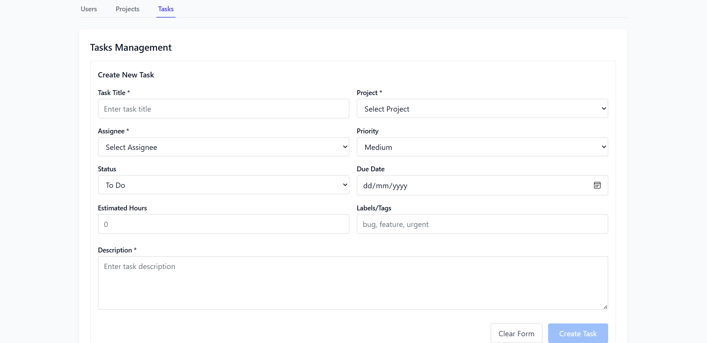
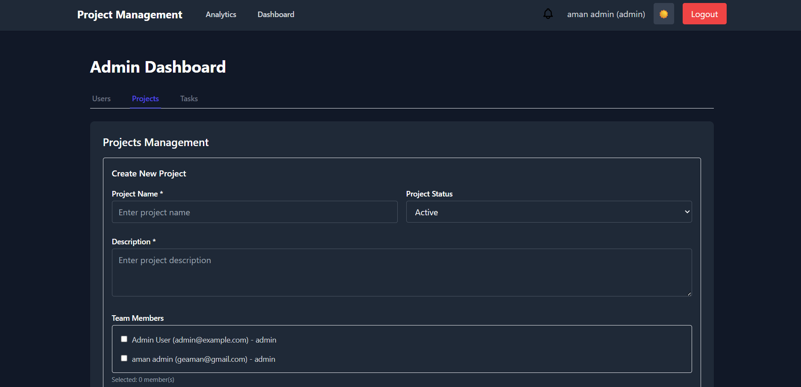
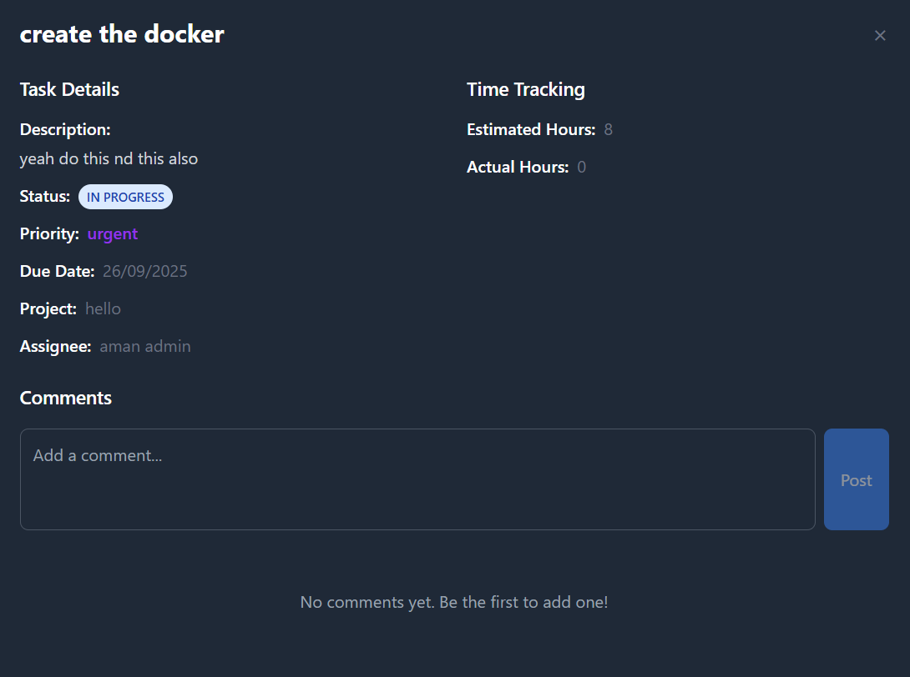
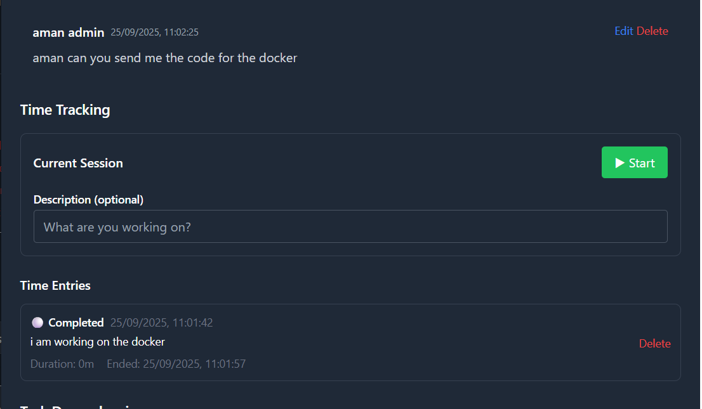
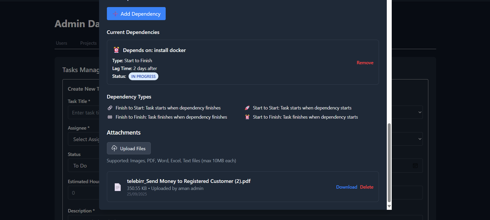

# Project & Task Management Application

A full-stack application for managing projects and tasks with role-based access control. Built with modern technologies and containerized for easy deployment.

## ✨ Features

- **🔐 User Authentication**: JWT-based authentication with secure login/logout
- **👥 Role-Based Access Control**: Two user roles with different permissions:
  - **Admin**: Full access to all resources
  - **Employee**: View and update assigned tasks
- **🌙 Dark/Light Mode**: Toggle between themes
- **⚡ Real-time Updates**: Using RTK Query for efficient data fetching
- **🔍 Task Filtering**: Filter tasks by status, assignee, and project
- **📎 File Attachments**: Upload and manage task attachments
- **⏱️ Time Tracking**: Track time spent on tasks
- **💬 Comments System**: Add comments to tasks
- **🔗 Task Dependencies**: Manage task relationships

## 📸 Screenshots

### Application Interface

**Login Page**

*Login page with authentication form*

**Admin Dashboard**

*Admin dashboard main interface*

**Employee Dashboard**

*Employee dashboard with task overview*

**Task Creation**

*Task creation form with all fields*

**Task Filtering**

*Task filtering interface in action*

**Dark Mode**

*Application in dark mode theme*

**Task Commenting**

*Task commenting interface*

**Time Tracking**

*Time tracking interface*

**File Attachments**

*File attachment interface*

## 🛠️ Tech Stack

### Frontend
- React with TypeScript
- Redux Toolkit (RTK) & RTK Query
- React Router for navigation
- Tailwind CSS for styling
- Theme context for dark/light mode

### Backend
- Node.js with Express
- TypeScript
- Sequelize ORM with PostgreSQL
- JWT authentication
- Role-based middleware
- File upload handling with Multer

## 🚀 Quick Start

### Using Docker (Recommended)

1. **Clone the repository:**
```bash
git clone https://github.com/Aman-byte1/project-task-management.git
cd project-task-management
```

2. **Start the application:**
```bash
docker-compose up -d
```

3. **Access the application:**
   - Frontend: http://localhost
   - Backend API: http://localhost:5000

### Default Admin User
- Email: admin@example.com
- Password: admin123
- Role: Admin

## 📄 License

MIT
