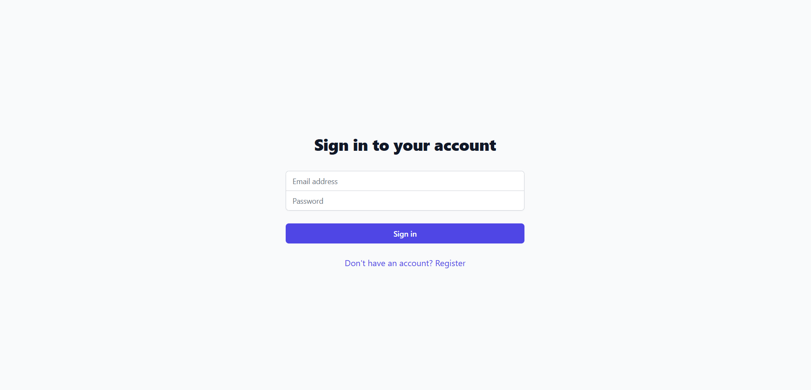
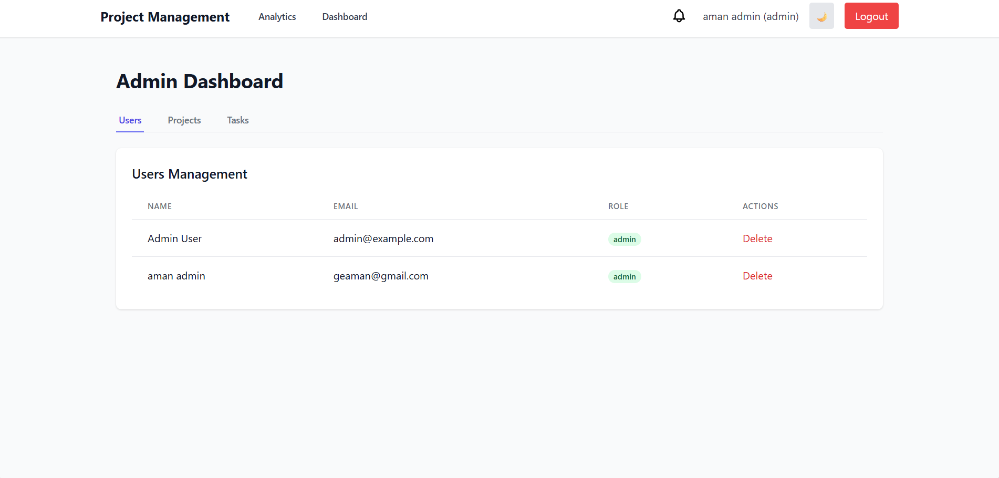
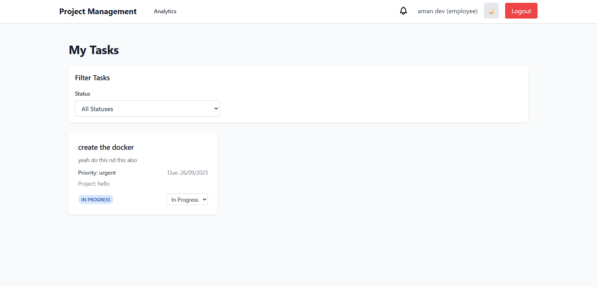
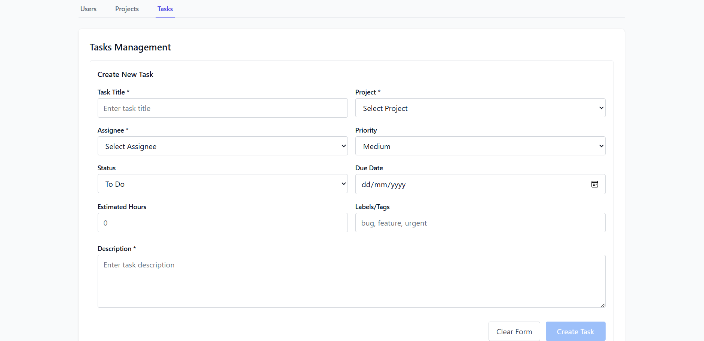
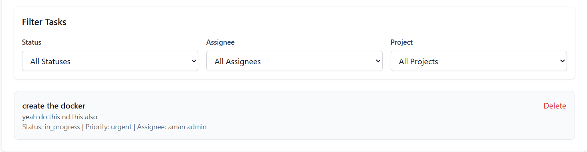
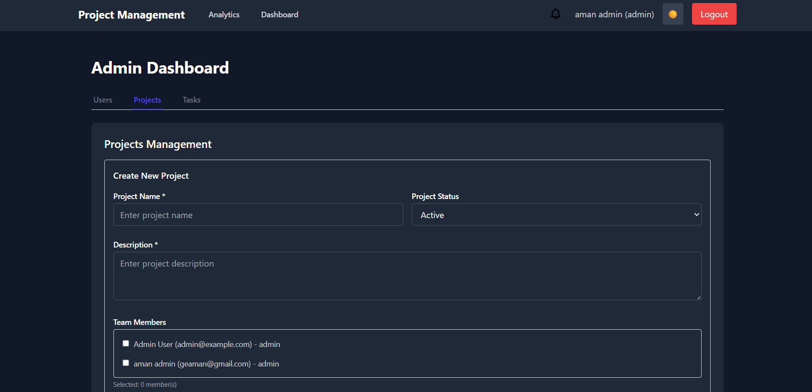
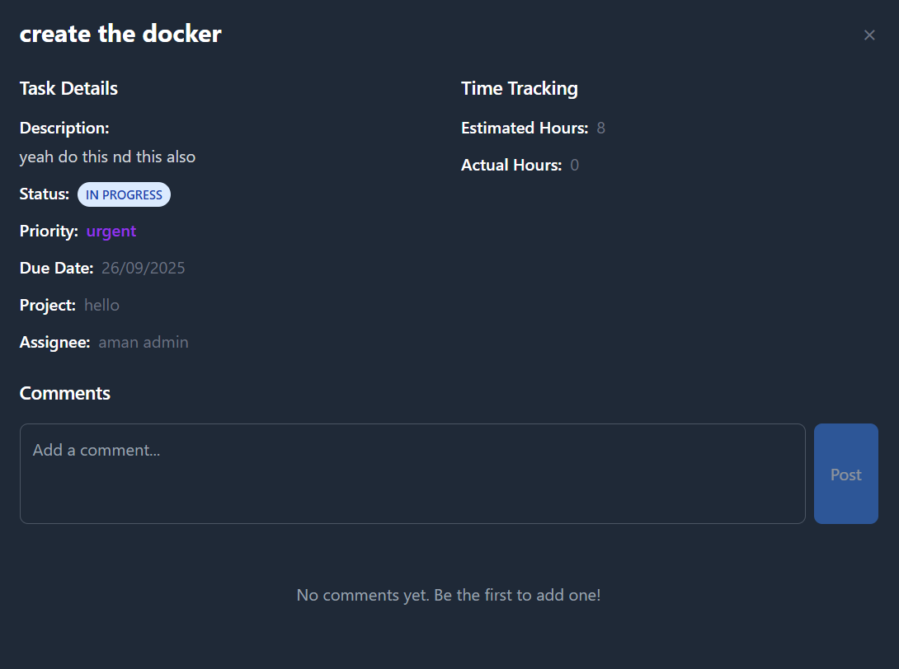
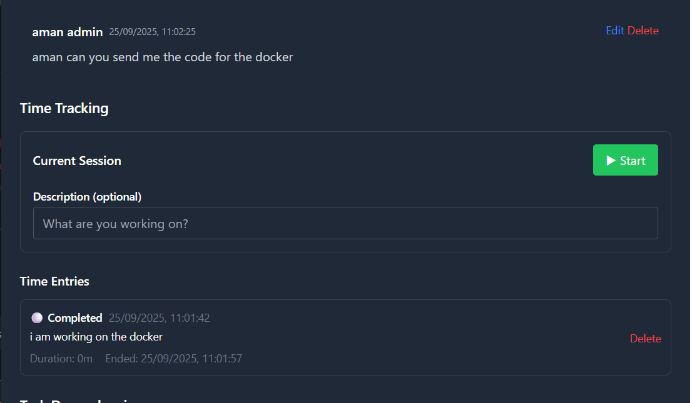
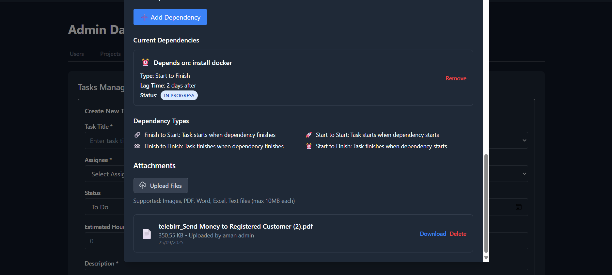

# Screenshots Documentation

This folder contains screenshots of the Project & Task Management Application to help users understand the interface and features.

## 📸 Recommended Screenshots to Take

### Application Interface

- **Login Page**: Login form with email/password fields
- **Admin Dashboard**: Main admin interface showing tabs (Users, Projects, Tasks)
- **Employee Dashboard**: Employee task view with filtering options
- **Dark/Light Mode**: Both theme variations

### Key Features

- **Task Creation Form**: Form for creating new tasks with all fields
- **Task Filtering**: Filter dropdowns in action (Status, Assignee, Project)
- **Task Details Modal**: Expanded task view with comments, time tracking, attachments
- **Project Management**: Project creation and listing interface
- **User Management**: User administration interface

### Docker Setup

- **Docker Compose Running**: Terminal output showing services starting
- **Application Running**: Browser showing the application at http://localhost
- **Database Connected**: MySQL container running successfully

## 📁 Screenshot Organization

### Naming Convention

Use descriptive names for your screenshots:

```
screenshots/
├── 01-login-page.png
├── 02-admin-dashboard.png
├── 03-employee-dashboard.png
├── 04-task-creation.png
├── 05-task-filtering.png
├── 06-dark-mode.png
├── 07-docker-setup.png
└── README.md
```

### Categories

- **01-09**: Application interface and main features
- **10-19**: Advanced features (comments, attachments, etc.)
- **20-29**: Docker and deployment
- **30-39**: Mobile/responsive views

## 🛠 How to Take Screenshots

### Windows

1. **Full Screen**: `Print Screen` key
2. **Active Window**: `Alt + Print Screen`
3. **Custom Area**: Use Snipping Tool or `Windows + Shift + S`

### Best Practices

- **High Quality**: Use PNG format for best quality
- **Consistent Size**: Try to keep similar dimensions
- **Clear Focus**: Ensure the relevant UI element is clearly visible
- **No Sensitive Data**: Avoid showing real user information
- **Good Lighting**: Ensure screenshots are bright and readable

## 📝 Adding to Documentation

After taking screenshots:

1. Save them in this folder with descriptive names
2. Update the main README.md to reference specific screenshots
3. Add captions explaining what each screenshot shows
4. Consider creating a simple HTML gallery for better presentation

## 🎯 Screenshots for README

The main README.md should reference these screenshots in relevant sections:

- Application overview section
- Features section
- Docker setup section
- API documentation section

### Available Screenshot References

**01-login-page.png**

*Login page with authentication form*

**02-admin-dashboard.png**

*Admin dashboard main interface*

**03-employee-dashboard.png**

*Employee dashboard with task overview*

**04-task-creation.png**

*Task creation form with all fields*

**05-task-filtering.png**

*Task filtering interface in action*

**06-dark-mode.png**

*Application in dark mode theme*

**06-task-commenting.png**

*Task commenting interface*

**07-task-time.png**

*Time tracking interface*

**08-attaching-files.png**

*File attachment interface*
